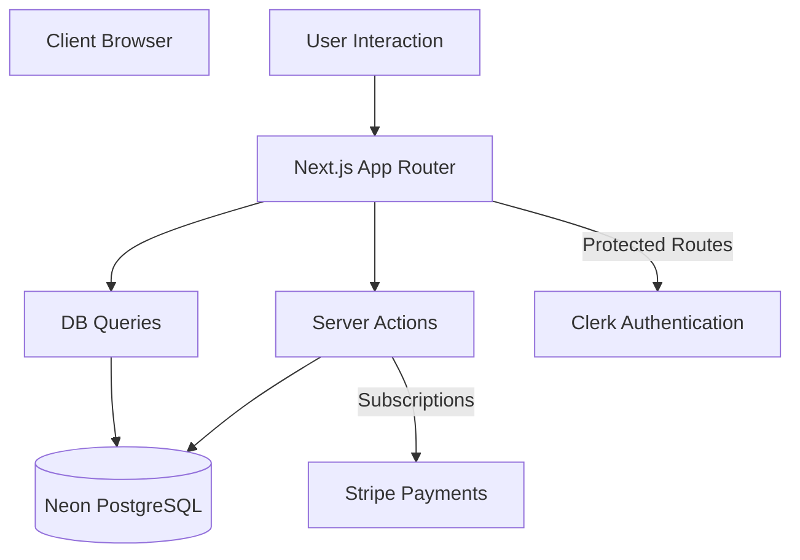

# Project Overview

Lingo is a gamified language learning platform built with Next.js, featuring interactive
lessons, experience points (XP), a hearts-based life system, and competitive leaderboards.
Inspired by popular apps like Duolingo, it integrates an administrative dashboard for
content management and Stripe for premium subscriptions, providing a full-stack,
production-ready educational experience.

## Repository Structure

- `actions/`: Next.js Server Actions for handling game logic, progress, and subscriptions.
- `app/`: Next.js App Router containing pages, layouts, and API routes (including `/admin`).
- `components/`: Reusable UI components built with Tailwind CSS 4 and Shadcn UI.
- `constants.ts`: Global application constants and configuration values.
- `db/`: Database layer including Drizzle schema, connection config, and optimized queries.
- `lib/`: Shared utility functions, Stripe client initialization, and administrative helpers.
- `public/`: Static assets including images, icons, and audio files for challenges.
- `scripts/`: Maintenance scripts for database seeding, resetting, and production prep.
- `store/`: Zustand stores for managing client-side application and game state.

## Build & Development Commands

```bash
# Install dependencies
npm install

# Run development server
npm run dev

# Build for production
npm run build

# Start production server
npm run start

# Linting and formatting
npm run lint
npm run lint:fix

# Database management
npm run db:push    # Push schema changes to the database
npm run db:studio  # Open Drizzle Studio for visual DB management
npm run db:seed    # Seed initial data for development
npm run db:reset   # Reset database to a clean state
```

## Code Style & Conventions

- **Language**: TypeScript is used throughout for strict type safety.
- **Styling**: Tailwind CSS 4 with Shadcn UI components.
- **Linting**: ESLint configured with Next.js vitals and `eslint-plugin-simple-import-sort`.
- **Formatting**:
  - Consistent import sorting: Frameworks first, then 3rd party, then internal aliases (`@/`).
  - JSX props must be sorted alphabetically with callbacks at the end.
- **Conventions**:
  - Use Server Actions (`actions/`) for all data mutations.
  - Keep components focused and reusable in `components/`.
  - Use Zod (or similar validation) within Server Actions.

## Architecture Notes



The application follows a modern Next.js architecture where Server Components fetch data
directly from the database via Drizzle queries, and Client Components trigger state changes
and mutations through Server Actions. Authentication is handled by Clerk, while payments and
subscriptions are managed via Stripe webhooks and checkout sessions.

## Testing Strategy

> TODO: Implement a comprehensive testing suite.

- **Unit Testing**: Recommended tool: Vitest for utility and logic testing.
- **Component Testing**: Recommended tool: React Testing Library.
- **E2E Testing**: Recommended tool: Playwright or Cypress for core learning flows.

## Security & Compliance

- **Authentication**: Powered by Clerk with middleware-based route protection.
- **Payments**: Stripe integration using secure checkout and signed webhooks.
- **Secrets**: Managed via `.env` file; never commit sensitive keys to version control.
- **Data Safety**: Server Actions should validate user ownership before performing mutations.

## Agent Guardrails

- **Protected Files**: Do not modify `.next/`, `node_modules/`, or `package-lock.json`.
- **Reviews**: Major schema changes in `db/schema.ts` require manual developer review.
- **Style Compliance**: All code changes must pass `npm run lint` before submission.
- **Modals**: Global modals are managed in `app/layout.tsx`; exercise caution when editing.

## Extensibility Hooks

- **New Lessons**: Add entries to `db/schema.ts` and use the `db:seed` script to populate.
- **UI Customization**: Extend or modify components in `components/ui` (Shadcn primitives).
- **Environment**: Add new configuration flags to the `.env` file and `constants.ts`.

## Further Reading

- [README.md](./README.md) - Project setup and feature overview.
- [Drizzle Documentation](https://orm.drizzle.team/) - For database schema and migrations.
- [Next.js Documentation](https://nextjs.org/docs) - For App Router and Server Actions.
